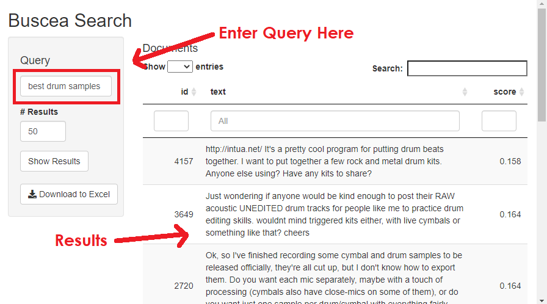

# bescea: Instant text search engine

**Author:** Harry Ahlas

**License:** [MIT](https://opensource.org/licenses/MIT)

In a matter of a few minutes, build a quick, smart Shiny app to search through your own text data. Ideally suited to search through a set of short comments for a query or theme. Input data should be an R data frame with one id column and one text column. 

## Installation

```r
devtools::install_github("harryahlas/bescea")
```

If you have not used R's *reticulate* package, please see the requirements section below prior to installing.

## Run bescea

```r
library(bescea)
besceaApp(data = sneapsters,         # Data frame, each document is a row/observation.
          text_field = "post_text",  # Text field from data frame
          unique_id = "textid")      # Unique identifier from data frame
```

## Shiny App

The code above first tokenizes your text using [SpaCy](https://spacy.io/), then generates a [fastText](https://fasttext.cc/) model. It uses [BM25Okapi](https://github.com/dorianbrown/rank_bm25) as a searching tool.  Finally, it generates a [Shiny](https://shiny.rstudio.com/) app in your browser to search your text.  You can download an .xlsx file of your results by clicking the *Download* button.

Longer queries tend to be more successful than short queries.  If a query like "data science" isn't working, try adding supplemental words to your query, such as "data science statistics code analytics".



## Build Model

You have the option to run and save your own *fastText* model for use with other searches. This will speed up runtimes and often improve results. This example uses the *sneapsters* data set to build a model and search.

```r
besceaBuildModel(data = sneapsters, 
                 text_field = "post_text",
                 unique_id = "textid", 
                 min_word_count = 3,              # Only consider tokens with at least n occurrences in the corpus
                 epochs = 30,                     # Number of fasttext epochs. More is generally better.
                 modelname = "my_fasttext_model") # Your model name, to be referred to when loading new data
```
## Run Using Prior Model

You also have the ability to use a model that you have already built, perhaps one based on a large corpus.  The example below loads the model from the example above, saving time as the app does not have to run a brand new model.

```r
besceaApp(data = sneapsters, 
          text_field = "thread_text",
          unique_id = "textid",
          modelname = "my_fasttext_model")  # Name of already built model 
```

## Requirements

Requires RStudio (*reticulate* and *tidyverse* packages) and Python (*pandas*, *re*, *spacy*, *rank_bm25*, *tqdm*, *pickle*, *numpy*, *gensim*, and *nmslib* modules). 

## Acknowledgements

This work is based **heavily** on foundational code provided by Josh Taylor (https://twitter.com/josh_taylor_01). 

- https://towardsdatascience.com/how-to-build-a-search-engine-9f8ffa405eac
- https://towardsdatascience.com/how-to-build-a-smart-search-engine-a86fca0d0795

